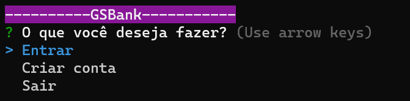

# ------GSBank------

**GSBank** é um sistema ATM simulado pelo terminal que usa as arroy keys como teclas de navegação padrão. O sistema possui a maioria das funcionalidades de um ATM convencional, como depósito, saque, entre outras funcionalidades. Esse projeto foi feito utilizando recursos simples do Node.JS, como as dependências: Inquirer, Chalk e Fs.

##### **IMPORTANTE!**

> Antes de dar deploy no projeto, certifique-se de que você tem o Node e o npm instalado. Para verificar, basta digitar e executar no terminal: "node -v" e "npm -v". Se após executar o comando retornar a versão, está instalado. Caso contrário, você não tem instalado e deverá instalar o node ou/e o npm. E por fim, execute o comando "npm install" para instalar todas as depêndencias para o projeto funcionar corretamente.

Para testar o projeto, execute o camando: **_npm start_**

Se o projeto estiver funcionando corretamente, quando executado o comando, o terminal deverá ficar dessa forma:

### Funcionalidades listadas

- Criação de conta
- Recuperação de senha
- Login
- Depositar
- Sacar
- Consultar saldo
- Investimento
- Consultar investimento
- Sacar investimento
- Sair

### Considerações finais

Esse projeto foi pensado e desenvolvido por mim, utilizando os aprendizados do curso **_Node.js do Zero a Maestria_**, ministrado pelo professor
 **_Matheus Battist_**.